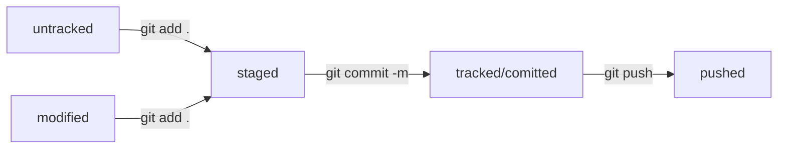

# Шпаргалка по GIT  
## Как установить Git, настроить репозиторий и работать с файлами
Для установки Git и инициализации репозитория выполните следующие действия:   
1. Установите Git 
2. Настройте config
```bash
git config --global user.name "Your Name" # указать имя, которым будут подписаны коммиты  
git config --global user.email "e@w.com"  # указать электропочту, которая будет в описании коммитера
```
3. Перейдите в каталог своего проекта и инициализируйте репозиторий с помощью команды 
```bash
git init
```
4. Создайте аккаунт на [GitHub](https://github.com/) и репозиторий  
5. Не забудьте про добавление ssh-ключа в профиль на GitHub  
6. Связываем локальный и удаленный репозиторий командой:
```bash
git remote add <адрес локального репозитории по ssh>
```

## Консольные команды Git  
* git add . - добавить в индекс все новые, изменённые, удалённые файлы из текущей директории и её поддиректорий  
* git add text.txt - добавить в индекс указанный файл (был изменён, был удалён или это новый файл)  
* git commit -m "Name of commit" - зафиксировать в коммите проиндексированные изменения (закоммитить), добавить сообщение  
* git push -u origin main - отправляем данные из локального репозитория в удаленный (в ветку main)  
* git log - показать коммиты в текущей ветке

## Подробнее о выводе git log  
История коммитов выглядит следующим образом:  
```bash
commit d99735bafa04ed7ead7e598678a59f457df9dfed (HEAD -> main, origin/main)
Author: Anna Tyrlova <amati91@yandex.ru>
Date:   Tue Jul 1 20:47:40 2025 +0300

    Добавила bash

commit 5d5d7da2f552ff8121ddf50fc2f85bf709c1171b
Author: Anna Tyrlova <amati91@yandex.ru>
Date:   Tue Jul 1 20:42:18 2025 +0300

    Правки верстки

commit 6a75ed23b9aa23644062fe3beddc6776fbc10d91
Author: Anna Tyrlova <amati91@yandex.ru>
Date:   Tue Jul 1 20:39:14 2025 +0300

    Добавила шпаргалку по git
```
Для каждого коммита ыводится хеш коммита (уникальный идентификатор), когда и кем был сделан коммит, сообщение коммита.  

## Что такое HEAD?  
Файл HEAD (англ. «голова», «головной») — один из служебных файлов папки .git. Он указывает на коммит, который сделан последним (то есть на самый новый).  
Если нужно передать последний коммит, то вместо его хеша можно передать HEAD, например, git reset HEAD.  

## Жизненный цикл файла в Git  


